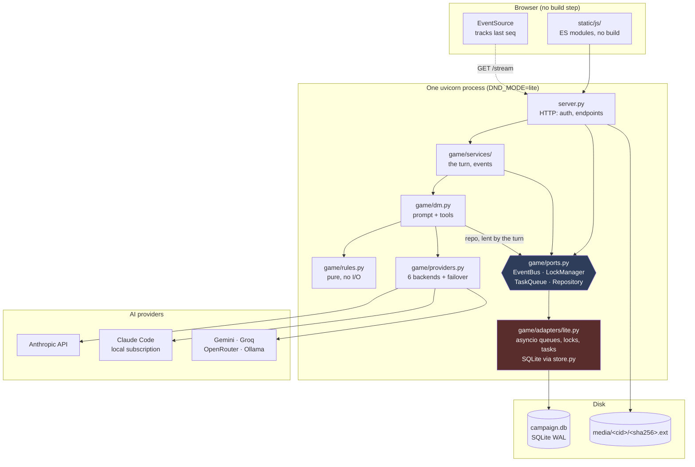
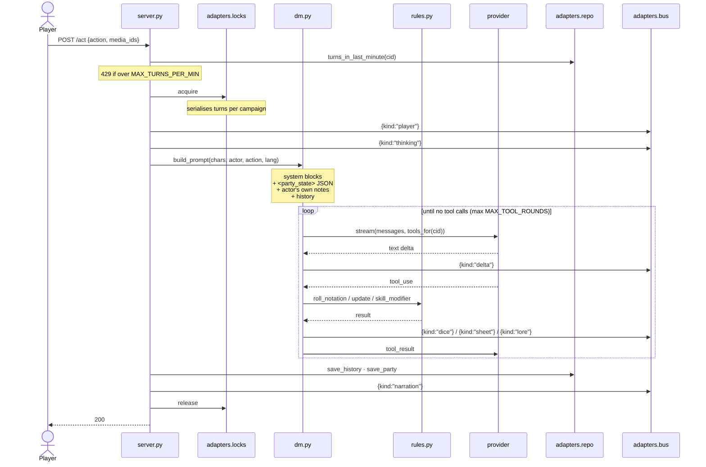
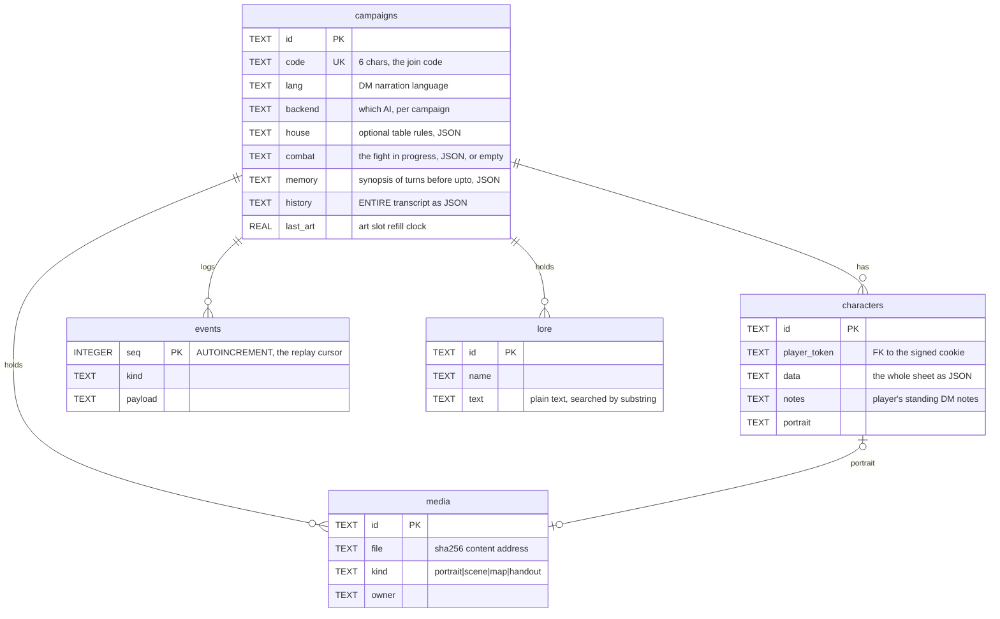
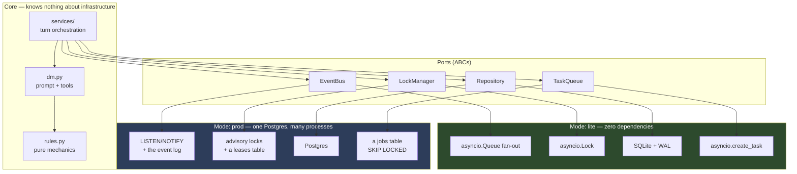
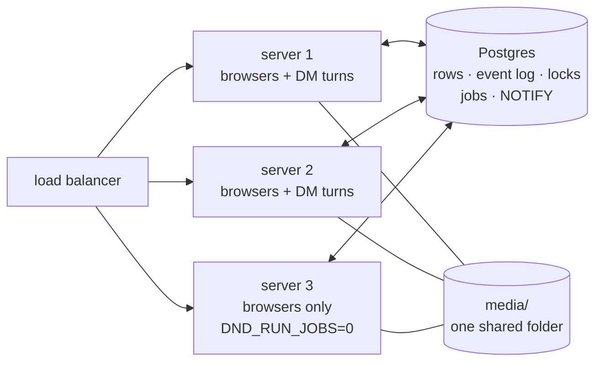

# Architecture

How AI Dungeon Master is built, why it is built that way, and where the seams are.

Written for two audiences: a contributor opening the repo for the first time, and an AI
agent asked to change something in it. Both need the same thing — the invariants, and
which lines of code they live on.

- [The one invariant](#the-one-invariant)
- [Current architecture](#current-architecture)
- [The turn loop](#the-turn-loop)
- [Data model](#data-model)
- [Module map](#module-map)
- [Target architecture](#target-architecture)
- [The four ports](#the-four-ports)
- [Known defects](#known-defects)
- [What this project deliberately does not do](#what-this-project-deliberately-does-not-do)
- [Extension points](#extension-points)

---

## The one invariant

**The language model narrates. Python owns every number.**

The model may never state a die result, an HP total, an AC, or a skill bonus that it did
not receive back from a tool call. Everything else in this document is downstream of that
sentence.

Three consequences that constrain every design decision:

1. **Mechanics live in `game/rules.py`, which does no I/O.** It is pure functions over
   plain dicts. It imports no database, no network, no framework. If a rule cannot be
   expressed as a pure function of character state, it does not belong there.
2. **A tool call is the only way state changes.** `roll_dice` and `update_character` are
   not conveniences for the model — they are the enforcement boundary. Adding a mechanic
   means adding a tool, not adding a sentence to the prompt.
3. **A weaker model degrades into prose, not into lies.** If a small local model forgets
   to call the dice tool, no dice chip appears and no sheet changes. The failure is
   visible. This is the property that makes a 3B model acceptable and it must not be
   traded away for convenience.

> **For AI agents working in this repo:** if a change would let the model decide a
> number, the change is wrong, however much simpler it looks. Prefer adding a tool.

---

## Current architecture



Everything that used to pin the server to a single process - who is watching a campaign,
whose turn it is, the guard on the opening scene, background tasks - now lives behind the
ports in `game/ports.py`. In `lite` mode the adapters (red) are still in-process, which is
what `lite` means: one machine, nothing to install. The difference is that it is now one
file's worth of decision rather than a property of the whole server.

Run two `lite` instances behind a load balancer and the old problems are all still there:

- a narration streamed by the instance handling the turn never reaches players whose SSE
  connection landed on the other instance;
- two players acting at once on different instances take the same turn twice, because
  neither instance's lock knows about the other.

`DND_MODE=prod` is what removes them: every port over one Postgres database, so any
number of processes serve one table - see [Several servers](#several-servers-dnd_modeprod).
Serverless hosting (Vercel, Netlify, Lambda) still cannot run this application, in either
mode: every browser holds a stream open for the whole session, and a DM turn runs for up
to a minute after the request that asked for it has been answered.

Slow image work — fetching a pasted link, decoding an upload — runs in worker threads via
`asyncio.to_thread`, never on the loop. The store gives each thread its own connection.

---

## The turn loop

The heart of the system. `POST /api/campaigns/{cid}/act`.



**Failover.** A provider error matching "out of credit / rate limited / bad key" discards
the partial text, walks `providers.failover_order()`, and retries on the next available
backend, emitting `{kind:"switch"}`. Partial text is discarded deliberately: half a
paragraph in one voice and half in another is worse than a one-second pause.

**`draw_scene` never joins this loop.** Image generation takes most of a minute, and this
loop is what streams narration to every browser at the table. Waiting here would freeze
the scene mid-sentence for everyone. It is dispatched independently and lands in the feed
when ready. Every failure path leaves the turn untouched.

**The replay contract.** Every state change is appended to `events` with a monotonic
`seq`. The browser remembers the last `seq` it saw; `GET /stream?since=N` replays the gap
before going live. This is what makes "join a four-hour-old campaign" and "my phone went
to sleep" the same code path, and it is the single most important thing to preserve when
touching the event system.

---

## Data model

Five tables. SQLite, WAL mode — note that **recent writes live in `campaign.db-wal`**, so
copying `campaign.db` alone loses data.



### Two blob columns carry most of the system

**`characters.data`** is the whole sheet as JSON: abilities, hp, ac, inventory,
conditions, skills. This is a feature, not laziness — it means a new mechanic needs no
schema migration, and it travels through export/import for free. The established pattern
for adding a field is a **lazy default on the read path**: see `rules.ensure_skills()`,
called from `store.party()`, which gives characters created before skills existed their
class defaults on first load.

**`campaigns.history`** is the entire transcript as one JSON TEXT column, and it is never
cut: it is the record, and what gets exported. What a model is *sent* is a window onto it —
everything after `campaigns.memory.upto`, with stale party snapshots trimmed — behind a
synopsis of the rest (`game/services/memory.py`). Every turn still reads and writes the
column whole, which is the remaining scaling cost in the data model. Phase 8 kept it one
column in Postgres too: only the turn writes it, under the turn lock, so it is never
contended - just big. Rows would buy smaller writes, not correctness.

### Identity

There are no user accounts. A signed cookie (`itsdangerous`, keyed by `SESSION_SECRET`)
carries an opaque `player_token`. That token is what owns a character row. Consequences:

- Clearing cookies orphans your character — which is why "pick an existing character"
  exists on the join screen (`store.claim_character`).
- Anyone with the campaign code can join and see all its media. This is stated in the
  player reference (docs/reference.md) because it matters before you upload a photo
  of a real person.
- `APP_PASSWORD` is a single shared door for the whole instance, not per-user auth.

### Language

Mechanical values are stored in **English** and translated at display: races, classes,
ability names, skill names. Prose written by people — character names, items the DM
invents, the story — is stored as typed. `game/i18n.py` holds the rule; `static/js/i18n/`
holds the browser half.

> One consequence bites anyone touching inventory: starting gear is **localised at
> creation** (`rules.new_character` calls `i18n.gear(item, lang)`), so a Thai campaign's
> `inventory` list contains Thai display strings, not keys. See
> [Known defects](#known-defects).

---

## Module map

| File | Lines | Owns | Reaches storage through |
|---|---|---|---|
| `server.py` | 1154 | HTTP: auth, endpoints, media, import/export | `A`, the server's adapters |
| `game/services/turn.py` | 129 | the DM turn as a queued job; effect expiry | the adapters it is handed |
| `game/services/events.py` | 34 | publish (logged) vs broadcast (transient) | the adapters it is handed |
| `game/ports.py` | 223 | the four interfaces — nothing else | — |
| `game/adapters/lite.py` | 181 | in-process bus, locks, queue; SQLite repository | `store.py` |
| `game/adapters/postgres/` | 1,028 | `DND_MODE=prod`: every port over one Postgres — `repo.py`, `live.py` (locks, bus, queue), `schema.py` | Postgres, via asyncpg |
| `game/providers.py` | 844 | 6 backends, format translation, failover, key storage | — |
| `game/store.py` | 651 | every SQLite statement; one connection per thread | SQLite |
| `game/dm.py` | 629 | system prompt, tool schemas, tool execution, prompt assembly | the `repo` the turn lends it |
| `game/claude_code.py` | 420 | Claude Pro/Max backend + its sign-in flow | the `call_tool` the DM lends it |
| `game/rules.py` | 526 | **dice, abilities, skills, AC, character gen — no I/O** | — |
| `game/media.py` | 286 | image validation, EXIF stripping, SSRF guards, file store | — |
| `game/lore.py` | 198 | encoding detection, HTML→text, substring search | — |
| `game/rulebook.py` | 156 | the SRD: sections by heading, ranked keyword search | `data/srd/*.md` |
| `tools/fetch_srd.py` | 151 | downloads the SRD 5.1 PDF and converts it to `data/srd/` | — |
| `tools/migrate_sqlite_to_pg.py` | 121 | copies `campaign.db` into Postgres, ids and `seq` intact | both |
| `tools/fetch_postgres.py` | 90 | a private Postgres for the prod-mode tests, on Windows | — |
| `game/i18n.py` | 179 | server strings: gear, narration instruction, CLI | — |
| `static/js/main.js` | 45 | entry: loads every module in order, then boots | — |
| `static/js/core/` | 80 | `dom.js`, `state.js`, `api.js` — leaves; import nothing | — |
| `static/js/i18n/` | 592 | `en.js`, `th.js` (one string table each), `index.js` (lookup) | — |
| `static/js/*.js` | 2,220 | one module per part of the page: stream, composer, dash, drawer, … | `api.js` |
| `dnd.py` / `play.py` | 322 / 272 | terminal client / tool CLI | none — no campaign |

**Dependency direction is strictly inward.** `rules.py` depends on nothing but `i18n`.
Nothing in `game/` imports `server.py`, and nothing above the ports imports what is below
them — `tests/test_boundaries.py` checks both. Keep it that way: it is what lets the test suite
drive the rules without a web server and the CLI share the same DM.

### The DM's tools

| Tool | Always on? | Does |
|---|---|---|
| `roll_dice` | yes | announces DC, then Python's RNG produces the number |
| `update_character` | yes | all hp/xp/gold/items/conditions, named to one character |
| `equip_armor` | yes | carried armour or a shield on or off; AC recomputed in Python |
| `set_effect` | yes | a named AC effect — bonus, unarmoured base, or floor — with a duration |
| `use_spell_slot` | yes | spends a slot from the SRD table; *refuses* when none is left |
| `long_rest` | yes | HP and slots restored, timed effects ended — one character or the party |
| `roll_initiative` | with a campaign | rolls every player character and the named enemies; mid-fight, adds without moving the turn |
| `next_turn` | with a campaign | passes the turn, drops the fallen; a new round ticks effect durations |
| `end_combat` | with a campaign | clears the order |
| `lookup_rule` | when a rulebook is installed | section-aware search of the SRD 5.1 in `data/srd/` |
| `search_lore` | only with documents | substring search over the campaign library |
| `draw_scene` | only with an image provider | one slot per `DM_ART_EVERY_TURNS` turns |

`dm.tools_for(cid)` assembles the list per campaign. **A tool with nothing behind it is
worse than no tool** — the model reaches for it anyway and gets an error, which spends a
round and confuses the narration. Conditional registration is deliberate.

---

## Target architecture

> **Status:** built. The ports and the `lite` adapters in Phase 2; the `prod` adapters in
> Phase 8, on Postgres alone - the Redis this sketch planned for turned out not to be
> needed. See [Several servers](#several-servers-dnd_modeprod).

The goal is to make horizontal scaling *possible* without making the single-host install
*worse*. Those two requirements are in tension, and the resolution is a port/adapter
boundary with two implementations of each port.



**Mode is chosen once at startup** from `DND_MODE` (`lite` | `prod`), defaulting to
`lite`. There is no per-call branching — `services/` receives injected adapters and never
asks which mode it is in. Any `if DATABASE_URL:` inside business logic is a bug.

The safety net under both is the **append-only event log with a monotonic `seq`**. Live
delivery is allowed to drop things; a browser that missed an event gets it from the log
when it reconnects. The turn lock is what keeps two turns from writing one campaign's
state at once - there is no optimistic concurrency on the character row, so the lock is
load-bearing, not an optimisation.

---

## Several servers (`DND_MODE=prod`)



One Postgres does everything Redis was going to, so a deployment runs one service, not two
(`game/adapters/postgres/`):

| Port | In Postgres | Why that way |
|---|---|---|
| `Repository` | the SQLite schema, JSON kept as TEXT | Every read-then-write is a transaction holding the row it read (`FOR UPDATE`): the summary that may only move forward, the illustration slot, a note added to the history. Appends to one campaign's log take turns under a transaction lock, because a sequence alone does not keep a reader in order - see `EventBus`. |
| `LockManager` | `hold`: a session advisory lock. `claim`: a row in `leases` with an expiry | An advisory lock belongs to a connection, so a server that dies mid-turn frees its campaign at once - nothing to expire, nothing to renew. Waiters on the same server queue on an asyncio lock first, so only one connection per key per server is ever spent waiting; those come from a pool of their own, so a holder's queries can never wait behind waiters for its own lock. |
| `EventBus` | `NOTIFY`, one listening connection per server, fanned out locally | A logged event is announced by `seq` only, and each server reads it back from the log - with anything before it not yet delivered. Two servers commit 10 then 11, but their notices may land 11 first; read from the log, 11 brings 10 with it. The same read recovers whatever passed while the listening connection was down. Unlogged events (thinking, streamed text) carry their own payload, through a side table when they exceed NOTIFY's 8000 bytes. |
| `TaskQueue` | a `jobs` table, taken with `FOR UPDATE SKIP LOCKED` and deleted as it is taken | **At most once.** A DM turn rolls dice and narrates; running one twice would be worse than losing it, so a job whose server dies half way is lost, as on one process. What is new is everything short of that: a queued turn, or an illustration or a combat nudge waiting out its delay, survives a restart. Job arguments must be JSON, and the one-process queue now insists on that too, so the whole suite checks it. |

What each server still keeps to itself, and what that means for a deployment:

- **Pictures are files.** Every server must see the same `media/` folder (`DND_MEDIA` on a
  shared volume). Object storage behind a `BlobStore` port was in the plan and is not built.
- **The session key must be shared.** `SESSION_SECRET` is required in prod mode - each
  server would otherwise make up its own, and a player would be a stranger to the next one.
- **Pasted keys stay where they were pasted**, so pasting keys into the running app is off
  by default in prod (`ALLOW_KEY_SETUP`); configure keys in the environment.
- **"Claude Pro/Max (this machine)"** drives the Claude Code on one machine, and only makes
  sense on that machine. A multi-server deployment uses API keys.

How it is held to the same behaviour as SQLite: `tests/test_postgres_repo.py` runs one
scenario through every repository method on both databases and requires identical results;
the race tests hold a campaign's row from outside while a dozen writers pile up, then let
them all go at once. `tests/test_postgres_live.py` runs every port across two adapter sets
sharing one database. `tests/test_prod_two_servers.py` starts two real server processes -
one of them never running a DM turn - and plays a table split across them. Bugs were
planted on purpose, one at a time; each of these tests failed on the one it exists to
catch. They need a Postgres: `tools/fetch_postgres.py` fetches a private one on Windows,
anything else finds a package-manager install, or `DND_TEST_DATABASE_URL` points at any
server. Without one they skip.

Moving an existing game: `tools/migrate_sqlite_to_pg.py` copies `campaign.db` - read
through SQLite, so the newest writes still in the WAL come too - keeping every id and
every event's `seq`, so join codes, links and each browser's place in the story survive.

---

## The four ports

The interfaces are in [`game/ports.py`](game/ports.py); read that file rather than a copy
of it here. What follows is what each one promises, and where the real thing differs from
the first sketch of it.

| Port | Promises | `lite` | Departed from the sketch |
|---|---|---|---|
| `EventBus` | `publish(cid, event)`; `async with subscribe(cid) as sub` registered on entry; `sub.next(timeout)` returns `None` on a quiet line | an `asyncio.Queue` per browser | Best effort, by contract: the event log is the guarantee, the bus the fast path. Dropping frames for a stalled subscriber is allowed. |
| `LockManager` | `async with hold(key)` — a critical section; `claim(key, ttl)` / `release(key)` — a lease | `asyncio.Lock`s, refcounted; a dict of expiries | **Gained `claim`.** Pressing Begin must stay claimed for as long as the opening scene takes to write, which outlives the request — a scoped lock cannot express that. And `hold` has **no timeout**: turns queue behind each other, as they always have. A timeout would have turned "wait your turn" into an error. |
| `TaskQueue` | `register(name, job)` once at start-up; `enqueue(name, **kwargs)` without waiting | `create_task`, references kept, failures logged | Jobs travel **by name** with plain-data arguments, because a coroutine cannot be sent to another process. A job receives the adapters it should use as its first argument. |
| `Repository` | every read and write of campaign state, async | delegates to `game/store.py` | 36 methods, mirroring the store. Async even though SQLite is not, so a Postgres adapter changes no caller — and the one built in Phase 8 changed none. |

The `prod` implementation of each is in [Several servers](#several-servers-dnd_modeprod).

### Two things the port boundary is not

**It is not a guarantee against races by itself.** In `lite` mode a repository call never
actually suspends — `await` on a coroutine with no real I/O inside runs straight through —
so a check followed by a write is atomic by accident. A networked database yields on every
call. Read-then-write sequences across several repository calls therefore hold a lock: joining a table (`roster:{cid}`:
seated already? table full? name taken?) and the image cap (`media:{cid}`).
`tests/test_ports_races.py` swaps in a repository that yields before every call and checks
that two people can still not both join as "Bram" — which, without the lock, they could.
Read-then-write *inside* one repository call is the repository's own job; the Postgres
one does it with row locks.

**It is not optional.** `tests/test_boundaries.py` reads the syntax tree of everything
above the ports and fails if any of it imports `game.store`, an adapter, `sqlite3`,
`asyncpg` or `redis`, if a service reaches for the server's global adapters instead of the ones it was
handed, if anything calls a repository method the port does not declare, or if a job is
enqueued under a name nobody registered.

### Who gets which adapters

The server builds one `Adapters` at import (`server.fresh_adapters`) and registers its
jobs on it; the app's lifespan calls `start` and `aclose`. Endpoints use it as `A`.
Services and jobs never touch `A` — they are handed adapters, so the same job can run on a
worker process that built its own. The DM is lent `repo` by the turn, and lends Claude
Code a `call_tool` in turn, so neither reaches back for storage.

---

## Known defects

Verified against the code, not inferred. Fixed ones stay listed, with what fixed them,
because the reasoning is what stops them coming back.

### Fixed

**1. AC was frozen at creation.** `new_character` wrote `12 + max(0, DEX mod)` and nothing
ever touched it again: armour, shields and spells did nothing, `12` had no basis in 5e,
and the clamp threw away DEX penalties. A starting Fighter in chain mail and a shield
showed 13 where the rules give 18. AC is now derived — `rules.compute_ac` from worn
armour, DEX, a shield and named effects — and `ch["ac"]` is only a cache of it. Old saves
are put in their starting armour and recomputed on load (`ensure_equipment`, the same
lazy pattern as `ensure_skills`). Covered by `tests/test_armour.py`.

**2. The SSRF guard had a DNS-rebinding window.** The hostname was resolved and checked,
then handed to `httpx`, which resolved it again. A TTL-0 DNS server could answer the
check with a public address and the fetch with `169.254.169.254`. Now `resolve_public`
resolves once, and the request is sent to that address with the real name kept in `Host`
and the TLS SNI, so certificate verification still applies (checked against a live HTTPS
host, and that a wrong name is refused). Every redirect hop is resolved and pinned the
same way. Covered by `tests/test_media_security.py`, which fails against the old code.

**3. Response bodies were buffered before their size was checked.** `len(r.content)` had
already read the whole body. Bodies now stream with a running count and stop at the cap;
a declared `Content-Length` over the cap is refused unread; a non-image `Content-Type` is
refused before Pillow sees it.

**4. Slow image work ran on the event loop.** `media.fetch` — blocking network I/O, up to
30 s a hop over four hops — and `media.process` — Pillow decoding up to 40 megapixels —
were called straight from `async` endpoints. While one player's pasted link trickled in,
narration froze for *every table on the server*. All five call sites now go through
`asyncio.to_thread`. Covered by `tests/test_event_loop.py`, which runs a heartbeat beside
the request: on the old code it managed one beat in 0.6 s.

**5. One SQLite connection was shared, with thread checks switched off.** An earlier
version of this document called that a live bug. It was not: every store call ran on the
event loop's thread, so the connection was in practice serialised. It was a latent one —
and #4's fix put threads in the process, which is exactly when it would have started to
bite. Connections are now one per thread with `check_same_thread` left on, so a
connection that wanders between threads raises instead of interleaving.
Covered by `tests/test_store_threads.py`.

**6. The schema was defined in two places.** `characters.portrait` existed only in
`_migrate`. It is in `SCHEMA` now; `_migrate` remains for databases created before it.

**7. `inventory` held localised display strings.** A Thai campaign stored `"ดาบสั้น"`,
not `"shortsword"`, and a count lived inside the text: five rations were the string
`"rations (5)"`. Items are now records — `{name, key, qty}` in `ch["items"]` — with the
name as the sheet spells it and an English rules key where the rules know the item.
`inventory` survives as a derived display list, rewritten from the records after every
change and never written to directly. Old saves are converted on load by splitting the
count off and mapping the name back through the translation table; anything unrecognised
is kept as itself. Checked against every character in the live database: nothing lost.
Covered by `tests/test_items.py`.

**8. Effect durations counted player actions, not rounds.** With five players a 10-turn
effect ran out five times as fast as with one. In a fight, durations now tick when a
round ends (`dm._combat`); outside one, they still tick per player action, which is the
only clock exploration has.

**9. Every turn re-sent the whole campaign.** Requests grew with every turn, total cost with
the square of the campaign's length, and past roughly 140 turns a request exceeded a 200K
context and the campaign stopped. Claude Code's 40-*message* window meant it forgot all but
the last ten-odd turns, silently. Now stale state is trimmed from what is sent, older turns
are condensed into a synopsis in the background, small contexts are fitted, and Claude Code's
window counts turns. Requests plateau around 16-21K tokens. Covered by `tests/test_memory.py`.

### Open

Nothing verified and unfixed at present. Findings from play that were deliberately left
alone are in `docs/playtest-findings.md`, each with the reason.

---

## What this project deliberately does not do

The most useful section for a contributor or an agent. These are decisions, not gaps —
"fixing" them is a regression unless the tradeoff is revisited on purpose.

| Not done | Why |
|---|---|
| **No build step** | `Play.cmd` must work on a machine with Python and nothing else. No npm, no bundler, no `node_modules`. This is load-bearing for how the app is distributed. |
| **No user accounts** | A signed cookie plus a 6-character code is the whole identity model. Accounts would need email, resets, and a privacy surface for a game six friends play. |
| **No monster sheets** | Enemies exist only in the initiative order, by name; the DM keeps their hit points in the narration. Giving every goblin a sheet is a much bigger game than this one, and the player-facing numbers are what need guarding. |
| **No saving-throw proficiencies** | Saves are rolled through `roll_dice` with the ability modifier the DM is shown. Modelling per-class save proficiencies is real work with no UI asking for it. |
| **A turn order that never blocks** | Initiative is rolled, shown and handed to the DM, but a player acting out of turn is not refused — the DM is told and fits it in. A strict queue stops the whole table when one friend steps away. `COMBAT_TURN_GRACE` lets a host add a clock instead. |
| **No OAuth against Claude/GPT/Gemini** | There is no OAuth scope that lets a web app spend somebody else's subscription. Anything claiming otherwise impersonates a browser session, which violates provider terms. The subscription backend drives locally-installed Claude Code instead, and its sign-in endpoints are **loopback-only** — whoever completes that sign-in decides which account pays for every turn. |
| **No word-based lore search** | Thai is written without spaces between words. Anything that splits on whitespace finds nothing in a Thai document. Plain substring matching is a correctness requirement, not laziness. |
| **No images in campaign history** | An attached image is sent on the turn it appears, then dropped. Left in, it is re-sent every turn and multiplies the bill silently. |
| **No serverless hosting** | See [Current architecture](#current-architecture). Read-only filesystem, ephemeral `/tmp`, and no shared memory for SSE subscribers. |
| **No CPU-waster to defeat Oracle's idle reclaim** | `tools/oracle-setup.sh` deliberately ships without one. Upgrading to Pay As You Go is the honest fix; burning power to lie to your host is not. |

---

## Extension points

| To add… | Touch | Notes |
|---|---|---|
| A **class or race** | `rules.CLASSES` / `RACES`, `CLASS_SKILLS`, `i18n.NAMES` | hit die, primary stat, gear, 3 skills |
| An **AI provider** | subclass `providers.Backend`, add to `_build()` | needs `available()` and a `stream()` yielding text deltas then one message in Anthropic block format |
| A **DM tool** | `dm.TOOLS` (or a conditional like `LORE_TOOL`), then `dm.run_tool` | execution must be in Python; emit an event so the table sees it happen |
| A **language** | `i18n.LANGUAGES`, `NARRATION_INSTRUCTION`, `GEAR`, `NAMES`, `CLI`; a `static/js/i18n/xx.js` registered in `STRINGS` in `static/js/i18n/index.js`; a `:root[data-lang="xx"]` font block in `style.css` | nothing else knows about languages |
| A **character field** | `rules.new_character` + a lazy default on the read path | follow `ensure_skills`; no migration needed, rides in `data` |
| The **DM's personality** | `dm.SYSTEM` | this one string is the whole voice, pacing, and house rules |

### Testing

```bash
pip install -r requirements-dev.txt
python -m pytest          # 491 tests, no API key, no model call
```

The 29 that test `DND_MODE=prod` need a Postgres and skip without one - see
[Several servers](#several-servers-dnd_modeprod) for where they find it.

Every backend in the suite is a stub: a DM that says exactly what the test scripted, an
artist that returns four pixels of PNG. Tests run against a throwaway database and media
folder and never touch `campaign.db`. The stub records what it was handed, which is how a
test can assert that a player's own notes and the right party state genuinely **arrived in
the prompt** rather than merely being saved somewhere.

When adding a mechanic, the test that matters is the one asserting the number the DM
received — not that the function returns the right value in isolation.

---

## See also

- [README.md](README.md) — how to start playing ([ไทย](README.th.md))
- [docs/reference.md](docs/reference.md) — every feature, hosting, keys, for players
  ([ไทย](docs/reference.th.md))
- [docs/REFACTORING_PLAN.md](docs/REFACTORING_PLAN.md) — phased plan with code
