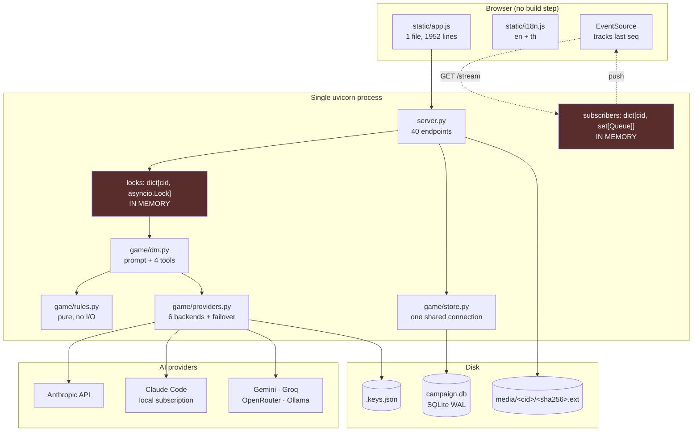
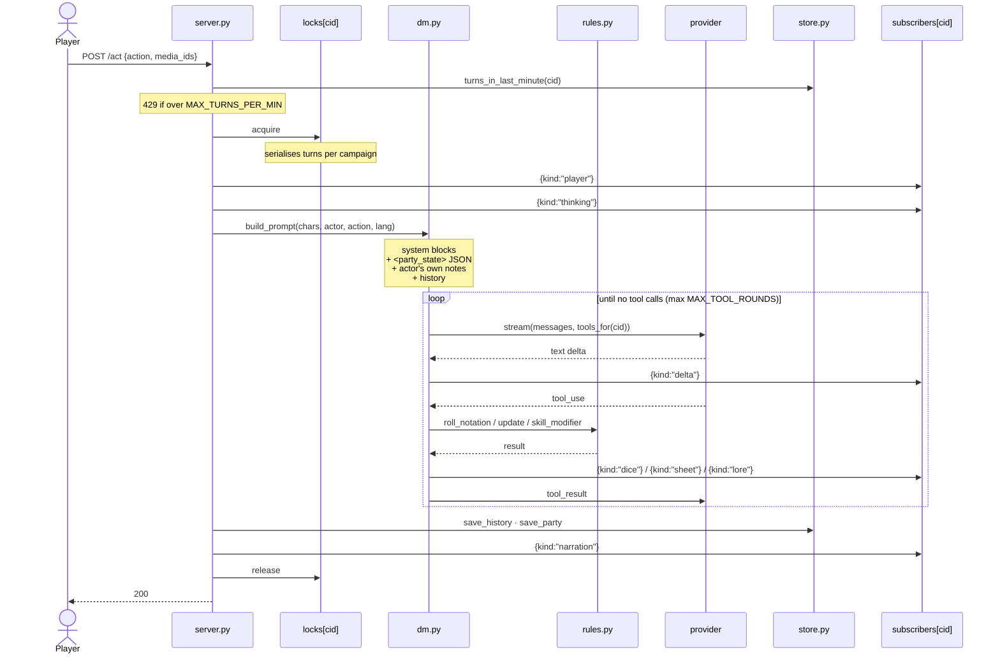
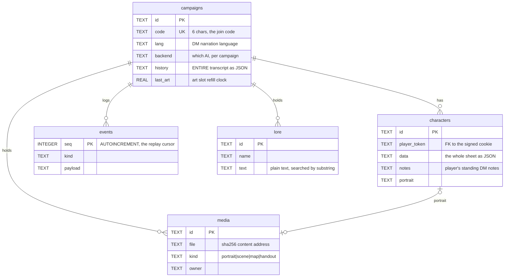
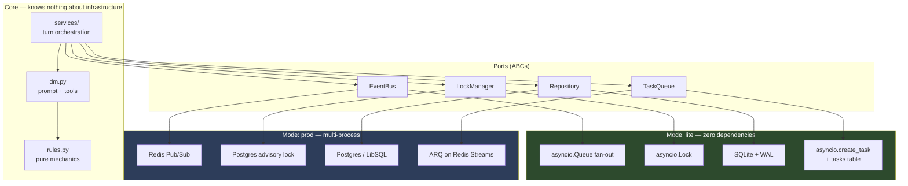
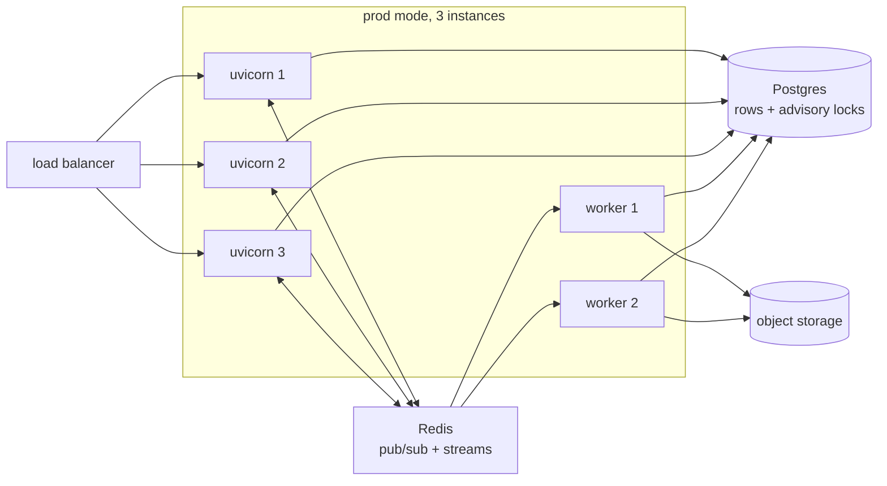

# Architecture

How AI Dungeon Master is built, why it is built that way, and where the seams are.

Written for two audiences: a contributor opening the repo for the first time, and an AI
agent asked to change something in it. Both need the same thing — the invariants, and
which lines of code they live on.

- [The one invariant](#the-one-invariant)
- [Current architecture](#current-architecture)
- [The turn loop](#the-turn-loop)
- [Data model](#data-model)
- [Module map](#module-map)
- [Target architecture](#target-architecture)
- [The four ports](#the-four-ports)
- [Known defects](#known-defects)
- [What this project deliberately does not do](#what-this-project-deliberately-does-not-do)
- [Extension points](#extension-points)

---

## The one invariant

**The language model narrates. Python owns every number.**

The model may never state a die result, an HP total, an AC, or a skill bonus that it did
not receive back from a tool call. Everything else in this document is downstream of that
sentence.

Three consequences that constrain every design decision:

1. **Mechanics live in `game/rules.py`, which does no I/O.** It is pure functions over
   plain dicts. It imports no database, no network, no framework. If a rule cannot be
   expressed as a pure function of character state, it does not belong there.
2. **A tool call is the only way state changes.** `roll_dice` and `update_character` are
   not conveniences for the model — they are the enforcement boundary. Adding a mechanic
   means adding a tool, not adding a sentence to the prompt.
3. **A weaker model degrades into prose, not into lies.** If a small local model forgets
   to call the dice tool, no dice chip appears and no sheet changes. The failure is
   visible. This is the property that makes a 3B model acceptable and it must not be
   traded away for convenience.

> **For AI agents working in this repo:** if a change would let the model decide a
> number, the change is wrong, however much simpler it looks. Prefer adding a tool.

---

## Current architecture



The two red boxes are why this is **one process, not a cluster**. `subscribers` and
`locks` are process-local dicts keyed by campaign id. Run two instances behind a load
balancer and:

- a narration streamed by the instance handling the turn never reaches players whose SSE
  connection landed on the other instance;
- two players acting at once on different instances take the same turn twice, because
  neither `asyncio.Lock` knows about the other.

This is an architectural property, not a configuration mistake. It is the reason
serverless hosting (Vercel, Netlify, Lambda) cannot run this application at all, and the
reason the [target architecture](#target-architecture) exists.

---

## The turn loop

The heart of the system. `POST /api/campaigns/{cid}/act`.



**Failover.** A provider error matching "out of credit / rate limited / bad key" discards
the partial text, walks `providers.failover_order()`, and retries on the next available
backend, emitting `{kind:"switch"}`. Partial text is discarded deliberately: half a
paragraph in one voice and half in another is worse than a one-second pause.

**`draw_scene` never joins this loop.** Image generation takes most of a minute, and this
loop is what streams narration to every browser at the table. Waiting here would freeze
the scene mid-sentence for everyone. It is dispatched independently and lands in the feed
when ready. Every failure path leaves the turn untouched.

**The replay contract.** Every state change is appended to `events` with a monotonic
`seq`. The browser remembers the last `seq` it saw; `GET /stream?since=N` replays the gap
before going live. This is what makes "join a four-hour-old campaign" and "my phone went
to sleep" the same code path, and it is the single most important thing to preserve when
touching the event system.

---

## Data model

Five tables. SQLite, WAL mode — note that **recent writes live in `campaign.db-wal`**, so
copying `campaign.db` alone loses data.



### Two blob columns carry most of the system

**`characters.data`** is the whole sheet as JSON: abilities, hp, ac, inventory,
conditions, skills. This is a feature, not laziness — it means a new mechanic needs no
schema migration, and it travels through export/import for free. The established pattern
for adding a field is a **lazy default on the read path**: see `rules.ensure_skills()`,
called from `store.party()`, which gives characters created before skills existed their
class defaults on first load.

**`campaigns.history`** is the entire transcript as one JSON TEXT column. Every turn reads
it whole and writes it back whole. This is the main scaling liability in the data model and
is addressed in the [refactoring plan](docs/REFACTORING_PLAN.md).

### Identity

There are no user accounts. A signed cookie (`itsdangerous`, keyed by `SESSION_SECRET`)
carries an opaque `player_token`. That token is what owns a character row. Consequences:

- Clearing cookies orphans your character — which is why "pick an existing character"
  exists on the join screen (`store.claim_character`).
- Anyone with the campaign code can join and see all its media. This is stated in the
  README because it matters before you upload a photo of a real person.
- `APP_PASSWORD` is a single shared door for the whole instance, not per-user auth.

### Language

Mechanical values are stored in **English** and translated at display: races, classes,
ability names, skill names. Prose written by people — character names, items the DM
invents, the story — is stored as typed. `game/i18n.py` holds the rule; `static/i18n.js`
holds the browser half.

> One consequence bites anyone touching inventory: starting gear is **localised at
> creation** (`rules.new_character` calls `i18n.gear(item, lang)`), so a Thai campaign's
> `inventory` list contains Thai display strings, not keys. See
> [Known defects](#known-defects).

---

## Module map

| File | Lines | Owns | Imports |
|---|---|---|---|
| `server.py` | 1210 | FastAPI: auth, campaigns, SSE, turn loop, media, import/export | everything |
| `game/providers.py` | 844 | 6 backends, format translation, failover, key storage | — |
| `game/store.py` | 611 | every SQLite touch | `rules` |
| `game/dm.py` | 476 | system prompt, tool schemas, tool execution, prompt assembly | `rules`, `store`, `lore` |
| `game/claude_code.py` | 421 | Claude Pro/Max backend + its sign-in flow | `providers` |
| `game/rules.py` | 228 | **dice, abilities, skills, character gen — no I/O** | `i18n` |
| `game/media.py` | 211 | image validation, EXIF stripping, SSRF guards, file store | — |
| `game/lore.py` | 198 | encoding detection, HTML→text, substring search | — |
| `game/i18n.py` | 179 | server strings: gear, narration instruction, CLI | — |
| `static/app.js` | 1952 | the entire UI | — |
| `static/i18n.js` | 488 | browser strings, en + th | — |
| `dnd.py` / `play.py` | 319 / 237 | terminal client / tool CLI | `game.*` |

**Dependency direction is strictly inward.** `rules.py` depends on nothing but `i18n`.
Nothing in `game/` imports `server.py`. Keep it that way: it is what lets the test suite
drive the rules without a web server and the CLI share the same DM.

### The DM's tools

| Tool | Always on? | Does |
|---|---|---|
| `roll_dice` | yes | announces DC, then Python's RNG produces the number |
| `update_character` | yes | all hp/xp/gold/items/conditions, named to one character |
| `search_lore` | only with documents | substring search over the campaign library |
| `draw_scene` | only with an image provider | one slot per `DM_ART_EVERY_TURNS` turns |

`dm.tools_for(cid)` assembles the list per campaign. **A tool with nothing behind it is
worse than no tool** — the model reaches for it anyway and gets an error, which spends a
round and confuses the narration. Conditional registration is deliberate.

---

## Target architecture

The goal is to make horizontal scaling *possible* without making the single-host install
*worse*. Those two requirements are in tension, and the resolution is a port/adapter
boundary with two implementations of each port.



**Mode is chosen once at startup** from `DND_MODE` (`lite` | `prod`), defaulting to
`lite`. There is no per-call branching — `services/` receives injected adapters and never
asks which mode it is in. Any `if REDIS_URL:` inside business logic is a bug.



Why **Postgres advisory locks rather than a Redis lock** for turn serialisation: it is one
fewer system in the critical path, and `pg_advisory_xact_lock` is released automatically
when the transaction ends — including when the worker holding it crashes. A Redis
`SETNX`+TTL lock needs a fencing token, a Lua compare-and-delete release, and a TTL tuned
longer than the slowest LLM turn, which is unbounded. Redis stays for pub/sub and the task
queue, where it is the right tool.

The real safety net is not the lock. It is the **append-only event log with a monotonic
`seq`** plus optimistic concurrency on the character row. The lock is an optimisation that
keeps two simultaneous turns from wasting tokens; correctness comes from the log.

---

## The four ports

```python
# game/ports.py — no implementation, no infrastructure imports
from abc import ABC, abstractmethod
from typing import AsyncIterator, Any


class EventBus(ABC):
    """Fan narration out to every browser watching a campaign."""

    @abstractmethod
    async def publish(self, cid: str, event: dict[str, Any]) -> None: ...

    @abstractmethod
    async def subscribe(self, cid: str) -> AsyncIterator[dict[str, Any]]:
        """Yields events until the consumer stops iterating."""


class LockManager(ABC):
    """Serialise turns within one campaign. Correctness still comes from the
    event log; this exists so two players don't burn tokens on the same turn."""

    @abstractmethod
    async def hold(self, key: str, *, timeout: float = 120.0): ...
    """Async context manager. Raises TimeoutError rather than queueing forever."""


class Repository(ABC):
    """Every persistence call. The only module allowed to know the storage engine."""
    # campaigns · characters · events · media · lore
    # mirrors today's game/store.py surface, async


class TaskQueue(ABC):
    """Work too slow for the request: image generation, TTS, summarisation."""

    @abstractmethod
    async def enqueue(self, job: str, **kwargs) -> str: ...

    @abstractmethod
    async def result(self, job_id: str) -> dict | None: ...
```

Implementations live in `game/adapters/{lite,prod}/`. The full bodies, the SSE bridge, and
the migration order are in [docs/REFACTORING_PLAN.md](docs/REFACTORING_PLAN.md).

---

## Known defects

Verified against the code, not inferred. Each is a real present-day bug with the line that
causes it.

### 1. AC is frozen at creation — `rules.py:167`

```python
"ac": 12 + max(0, modifier(scores["DEX"])),
```

Written once by `new_character` and never recomputed. **Armour does nothing**, shields do
nothing, spell effects do nothing. Two further errors in that one line:

- `12 +` has no basis in 5e. Unarmoured AC is `10 + DEX`; `12` is an invented baseline.
- `max(0, ...)` clamps a negative DEX modifier to zero. 5e applies it. A DEX 8 character
  should be AC 9 unarmoured, not 10.

The AC tile on the dashboard is therefore inert and slightly wrong. Fixed in Phase 1.

### 2. SSRF guard has a DNS-rebinding window — `media.py:120-128`

```python
_is_public(parsed.hostname)        # resolution #1: validated
...
r = http.get(target, ...)          # resolution #2: NOT validated
```

`_is_public` resolves the hostname and checks the IPs, then `httpx` resolves the hostname
**again** when it connects. An attacker-controlled DNS server with TTL 0 returns a public
address to the check and `169.254.169.254` to the fetch. The per-redirect-hop re-check has
the same hole. Fix: resolve once, validate, then connect to the validated IP directly with
the original `Host` header.

### 3. Response body is buffered before its size is checked — `media.py:152`

```python
if len(r.content) > MAX_UPLOAD_BYTES:
```

`r.content` has already read the entire response into memory. A malicious or merely broken
server can stream gigabytes and exhaust the process before this line runs. There is also
no `Content-Type` check on the response. `process()` validating via Pillow is the real
defence, so this is availability rather than integrity — but it is trivially exploitable.
Fix: `stream()` with a running byte counter that aborts at the cap.

### 4. One shared SQLite connection — `store.py:88-107`

```python
_conn = None
def db():
    global _conn
    if _conn is None:
        _conn = connect()   # check_same_thread=False
```

A single module-level connection shared by every concurrent request, with thread checking
disabled. SQLite serialises writes so this mostly works, but interleaved transactions on
one connection have no isolation from each other, and a `BEGIN` from one request can
swallow another's writes. Fix: connection-per-request, or a pool, behind the `Repository`
port.

### 5. `inventory` holds localised display strings — `rules.py:171`

```python
"inventory": [i18n.gear(item, lang) for item in kit],
```

A Thai campaign stores `"ดาบสั้น"`, not `"shortsword"`. This breaks the project's own
stated rule that mechanical values are stored in English and translated at display — and
it means **an equipment system cannot be built by adding an `equipped` flag to these
strings**, because there is nothing stable to key an armour table against.

This is the finding that shapes the inventory work: items must become records with
English keys, with a reverse-mapping migration through `i18n.GEAR` for existing saves and
free-text passthrough for anything unrecognised. See the plan's Phase 3.

### 6. Schema is defined in two places — `store.py:27` and `store.py:109`

`characters.portrait` exists only in `_migrate`, not in `SCHEMA`. A fresh database gets it
by `ALTER TABLE` immediately after creation. It works, but the table's true shape is now
the union of two code paths, which is how columns get missed.

---

## What this project deliberately does not do

The most useful section for a contributor or an agent. These are decisions, not gaps —
"fixing" them is a regression unless the tradeoff is revisited on purpose.

| Not done | Why |
|---|---|
| **No build step** | `Play.cmd` must work on a machine with Python and nothing else. No npm, no bundler, no `node_modules`. This is load-bearing for how the app is distributed. |
| **No user accounts** | A signed cookie plus a 6-character code is the whole identity model. Accounts would need email, resets, and a privacy surface for a game six friends play. |
| **No saving throws, spell slots, or initiative** (yet) | Modelled in the user's own campaign notes and reachable via `search_lore`. Adding them to code is real work with no UI asking for it — until Phase 2 of the plan. |
| **No OAuth against Claude/GPT/Gemini** | There is no OAuth scope that lets a web app spend somebody else's subscription. Anything claiming otherwise impersonates a browser session, which violates provider terms. The subscription backend drives locally-installed Claude Code instead, and its sign-in endpoints are **loopback-only** — whoever completes that sign-in decides which account pays for every turn. |
| **No word-based lore search** | Thai is written without spaces between words. Anything that splits on whitespace finds nothing in a Thai document. Plain substring matching is a correctness requirement, not laziness. |
| **No images in campaign history** | An attached image is sent on the turn it appears, then dropped. Left in, it is re-sent every turn and multiplies the bill silently. |
| **No serverless hosting** | See [Current architecture](#current-architecture). Read-only filesystem, ephemeral `/tmp`, and no shared memory for SSE subscribers. |
| **No CPU-waster to defeat Oracle's idle reclaim** | `tools/oracle-setup.sh` deliberately ships without one. Upgrading to Pay As You Go is the honest fix; burning power to lie to your host is not. |

---

## Extension points

| To add… | Touch | Notes |
|---|---|---|
| A **class or race** | `rules.CLASSES` / `RACES`, `CLASS_SKILLS`, `i18n.NAMES` | hit die, primary stat, gear, 3 skills |
| An **AI provider** | subclass `providers.Backend`, add to `_build()` | needs `available()` and a `stream()` yielding text deltas then one message in Anthropic block format |
| A **DM tool** | `dm.TOOLS` (or a conditional like `LORE_TOOL`), then `dm.run_tool` | execution must be in Python; emit an event so the table sees it happen |
| A **language** | `i18n.LANGUAGES`, `NARRATION_INSTRUCTION`, `GEAR`, `NAMES`, `CLI`; a `STRINGS` block in `static/i18n.js`; a `:root[data-lang="xx"]` font block in `style.css` | nothing else knows about languages |
| A **character field** | `rules.new_character` + a lazy default on the read path | follow `ensure_skills`; no migration needed, rides in `data` |
| The **DM's personality** | `dm.SYSTEM` | this one string is the whole voice, pacing, and house rules |

### Testing

```bash
pip install -r requirements-dev.txt
python -m pytest          # 89 tests, no API key, no model call
```

Every backend in the suite is a stub: a DM that says exactly what the test scripted, an
artist that returns four pixels of PNG. Tests run against a throwaway database and media
folder and never touch `campaign.db`. The stub records what it was handed, which is how a
test can assert that a player's own notes and the right party state genuinely **arrived in
the prompt** rather than merely being saved somewhere.

When adding a mechanic, the test that matters is the one asserting the number the DM
received — not that the function returns the right value in isolation.

---

## See also

- [README.md](README.md) — setup, hosting, and every feature, for players
- [README.th.md](README.th.md) — the same in Thai
- [docs/REFACTORING_PLAN.md](docs/REFACTORING_PLAN.md) — phased plan with code
