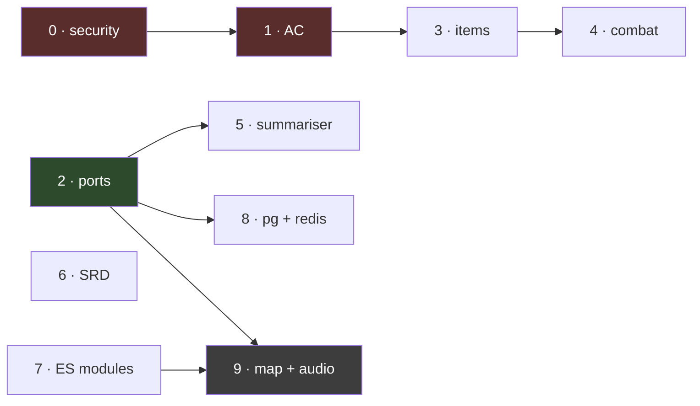
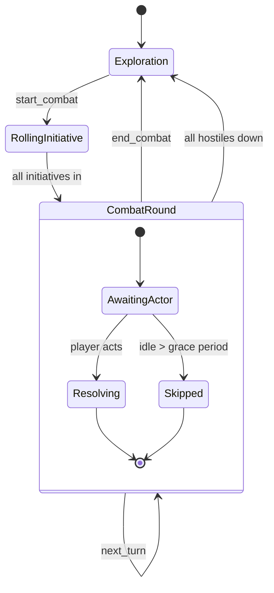
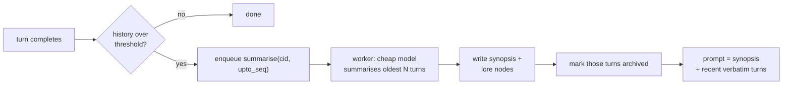

# Refactoring & Scaling Plan

Companion to [ARCHITECTURE.md](../ARCHITECTURE.md). That document describes the system;
this one is the ordered work queue, with the code.

**Read the ordering section first.** Several items here are cheap and fix real bugs; others
are large and only pay off under load this application may never see. Doing them in the
wrong order spends weeks adding infrastructure to a game six people play.

- [Priority ordering](#priority-ordering)
- [Phase 0 — real bugs, hours each](#phase-0--real-bugs-hours-each)
- [Phase 1 — dynamic AC and the effects system](#phase-1--dynamic-ac-and-the-effects-system)
- [Phase 2 — the port boundary](#phase-2--the-port-boundary)
- [Phase 3 — items, equipment, resources](#phase-3--items-equipment-resources)
- [Phase 4 — combat and initiative](#phase-4--combat-and-initiative)
- [Phase 5 — context compaction](#phase-5--context-compaction)
- [Phase 6 — SRD retrieval](#phase-6--srd-retrieval)
- [Phase 7 — frontend modularisation](#phase-7--frontend-modularisation)
- [Phase 8 — prod adapters](#phase-8--prod-adapters)
- [Phase 9 — battle map, audio, TTS](#phase-9--battle-map-audio-tts)
- [Three recommendations against the brief](#three-recommendations-against-the-brief)

---

## Priority ordering

Sorted by value per unit of work, not by the order the pillars were listed.

| # | Phase | Effort | Why here |
|---|---|---|---|
| 0 | SSRF rebinding, streaming size cap, connection handling | ~1 day | **Done.** Also moved image work off the event loop — see below. |
| 1 | Dynamic AC + effects | ~2 days | **Done.** |
| 2 | Port boundary (`lite` adapters only) | ~1 week | **Done.** |
| 3 | Items as records + equipment | ~1 week | **Done.** |
| 4 | Combat, initiative, turn queue | ~1 week | **Done.** |
| 5 | Summarisation worker | ~4 days | **Done.** 88% fewer input tokens over 200 turns. |
| 6 | SRD retrieval | ~3 days | **Done.** SRD 5.1, 2,117 sections. |
| 7 | Frontend ES modules | ~1 week | Pure refactor, no behaviour change. Do before 9. |
| 8 | Postgres + Redis adapters | ~1.5 weeks | **Only if you actually need >1 process.** |
| 9 | Battle map, fog of war, audio, TTS | ~3 weeks+ | Roughly doubles the frontend. |

**If this gets cut, cut from the bottom.** Phases 0–2 are unambiguous wins. Phase 8 is
infrastructure you should not buy until a measurement says you need it — a single uvicorn
process on the Oracle ARM box handles a few dozen concurrent tables, because the
bottleneck is the LLM's latency, not Python's.



---

## Phase 0 — real bugs, hours each

> **Done.** What shipped differs from the sketch below in two places worth knowing.
> Connection handling turned out to be a *latent* bug, not a live one — every store call
> already ran on the event loop's thread. The live bug it was hiding was the event loop
> itself: `media.fetch` and `media.process` blocked it, stalling every table's narration.
> Both now run in `asyncio.to_thread`, which is what made per-thread connections
> necessary. See ARCHITECTURE.md, Known defects.

### 0.1 Close the DNS-rebinding window

Resolve once, validate, then connect to **that IP**, carrying the original `Host` header so
virtual hosting and TLS still work.

```python
# game/media.py
import ipaddress, socket, ssl
import httpx

BLOCKED_PORTS = {22, 23, 25, 445, 3306, 5432, 6379, 11211, 27017}


def _validated_ips(host: str) -> list[str]:
    """Resolve once and return only addresses we are willing to talk to.

    Returning the addresses — rather than a bool — is the whole point: the caller
    connects to one of these, so there is no second resolution for an attacker's
    TTL-0 DNS to answer differently.
    """
    try:
        infos = socket.getaddrinfo(host, None, type=socket.SOCK_STREAM)
    except socket.gaierror:
        raise MediaError("couldn't look up that address")

    ips = []
    for info in infos:
        ip = ipaddress.ip_address(info[4][0])
        if (ip.is_private or ip.is_loopback or ip.is_link_local or ip.is_reserved
                or ip.is_multicast or ip.is_unspecified
                or (ip.version == 6 and ip.ipv4_mapped
                    and ipaddress.ip_address(ip.ipv4_mapped).is_private)):
            raise MediaError("that address isn't allowed")
        ips.append(str(ip))
    if not ips:
        raise MediaError("couldn't look up that address")
    return ips


def _pinned_client(host: str, ip: str, port: int) -> httpx.Client:
    """A client hard-wired to one validated IP, still presenting the real Host."""
    transport = httpx.HTTPTransport(retries=0)
    return httpx.Client(
        transport=transport,
        timeout=httpx.Timeout(10.0, read=20.0),
        follow_redirects=False,
        headers={"Host": host, "Accept": "image/*"},
        # httpx resolves from the URL, so the URL carries the IP and Host carries the name
    )
```

> **Implementation note.** `httpx` has no first-class "connect to this IP, send that Host"
> switch. Two workable routes: build the request URL against the IP and set `Host`
> explicitly (works for HTTP; for HTTPS you must also pass `server_hostname` through a
> custom `SSLContext` or certificate validation fails against the IP), or install a
> resolver-level pin. The second is cleaner — a small `httpx.BaseTransport` subclass whose
> `handle_request` rewrites `request.url.host` to the pinned IP and sets
> `extensions["sni_hostname"] = host`. Pick one and write a test that asserts a
> `169.254.169.254` second answer is refused; without that test this fix will silently rot.

### 0.2 Cap the body while streaming it

```python
def _read_capped(r: httpx.Response, cap: int) -> bytes:
    """Abort mid-download rather than buffering a hostile response."""
    if (declared := r.headers.get("content-length")) and int(declared) > cap:
        raise MediaError(f"that image is over {cap // (1024*1024)}MB")

    chunks, total = [], 0
    for chunk in r.iter_bytes(64 * 1024):
        total += len(chunk)
        if total > cap:                      # the declared length is a hint, not a promise
            raise MediaError(f"that image is over {cap // (1024*1024)}MB")
        chunks.append(chunk)
    return b"".join(chunks)
```

Use it with `client.stream("GET", url)` instead of `client.get`. Also reject a response
whose `Content-Type` is not `image/*` before handing bytes to Pillow — defence in depth;
Pillow's own decode remains the real check.

### 0.3 Stop sharing one SQLite connection

Interim fix that needs no port boundary — a connection per task, via a context manager:

```python
# game/store.py
import contextlib, sqlite3, threading

_local = threading.local()

@contextlib.contextmanager
def tx():
    """A transaction on this thread's own connection. Commits, or rolls back."""
    conn = getattr(_local, "conn", None)
    if conn is None:
        conn = _local.conn = connect()
        conn.executescript(SCHEMA)
        _migrate(conn)
        conn.commit()
    try:
        yield conn
        conn.commit()
    except Exception:
        conn.rollback()
        raise
```

Then fold `SCHEMA` and `_migrate` into one source of truth so `characters.portrait` stops
being defined only in the migration path (defect 6).

### 0.4 Tests that must exist before Phase 0 closes

```python
def test_url_fetch_refuses_rebound_second_resolution(monkeypatch):
    """First resolution public, second private — the fetch must not happen."""

def test_url_fetch_aborts_oversized_stream():
    """A server that streams past the cap is cut off, not buffered."""

def test_concurrent_writes_do_not_interleave():
    """Two simultaneous update_character calls both land."""
```

---

## Phase 1 — dynamic AC and the effects system

> **Done**, with three departures from the sketch: equipment is an `equipment` slot map
> pointing at inventory lines rather than item records (those are Phase 3); heavy armour
> ignores DEX *entirely*, a penalty included, which the sketch's `min(dex, cap)` got wrong;
> and there is no Barbarian or Monk in this game, so no unarmoured-defence table. Effect
> durations count table turns until Phase 4 adds rounds. The tool is `equip_armor`, not
> `equip_item` — it only ever touches armour and shields, and the name should say so.

Replace the frozen integer with a computed value and a breakdown. The breakdown matters:
the DM narrates from it and the dashboard explains itself.

### 1.1 Armour data

```python
# game/rules.py

UNARMOURED_BASE = 10

# key -> (base AC, max DEX bonus or None for uncapped, category)
ARMOUR = {
    "padded":          (11, None, "light"),
    "leather armor":   (11, None, "light"),
    "studded leather": (12, None, "light"),
    "hide armor":      (12, 2, "medium"),
    "chain shirt":     (13, 2, "medium"),
    "scale mail":      (14, 2, "medium"),
    "breastplate":     (14, 2, "medium"),
    "half plate":      (15, 2, "medium"),
    "ring mail":       (14, 0, "heavy"),
    "chain mail":      (16, 0, "heavy"),
    "splint":          (17, 0, "heavy"),
    "plate":           (18, 0, "heavy"),
}

SHIELDS = {"shield": 2}

# class features that replace the unarmoured base entirely
UNARMOURED_DEFENCE = {
    "Barbarian": "CON",
    "Monk":      "WIS",
}
```

### 1.2 The calculation

```python
def compute_ac(ch) -> dict:
    """Work out AC from equipment and active effects.

    Returns a breakdown, not just a number: the DM quotes it when it narrates a
    miss, and the dashboard shows why the number is what it is. `ch["ac"]` is a
    cache of `breakdown["total"]` and is never authoritative.
    """
    dex = modifier(ch["abilities"]["DEX"])
    worn = equipped(ch, "armor")
    parts = []

    if worn and worn["key"] in ARMOUR:
        base, cap, _ = ARMOUR[worn["key"]]
        dex_applied = dex if cap is None else min(dex, cap)
        parts.append((worn["key"], base))
    else:
        base = UNARMOURED_BASE
        dex_applied = dex                      # 5e applies a NEGATIVE DEX mod too
        ability = UNARMOURED_DEFENCE.get(ch["class"])
        if ability:
            bonus = modifier(ch["abilities"][ability])
            parts.append((f"unarmoured defence ({ability})", bonus))
            base += bonus
        parts.append(("unarmoured", UNARMOURED_BASE))

    total = base + dex_applied
    parts.append(("DEX", dex_applied))

    if (shield := equipped(ch, "shield")) and shield["key"] in SHIELDS:
        bump = SHIELDS[shield["key"]]
        total += bump
        parts.append((shield["key"], bump))

    # effects either add a flat bonus or raise the floor (mage armor sets base 13)
    for fx in ch.get("effects", []):
        if (bump := fx.get("ac_bonus")):
            total += bump
            parts.append((fx["name"], bump))
        if (floor := fx.get("ac_floor")) and total < floor + dex_applied:
            lift = (floor + dex_applied) - total
            total += lift
            parts.append((fx["name"], lift))

    return {"total": total, "parts": parts, "dex_capped": worn is not None
            and ARMOUR.get(worn["key"], (0, None, ""))[1] is not None
            and dex > ARMOUR[worn["key"]][1]}


def recompute_ac(ch) -> dict:
    """Recalculate and write the cache. Call after ANY equipment or effect change."""
    breakdown = compute_ac(ch)
    ch["ac"] = breakdown["total"]
    return breakdown
```

### 1.3 Where it must be called

`recompute_ac` is only correct if nothing can change equipment or effects without it. Four
call sites, and a test for each:

| Trigger | Site |
|---|---|
| character creation | `rules.new_character` — replaces the literal |
| equip / unequip | the new `equip_item` tool |
| effect applied or expired | the new `set_effect` tool, and the turn-end sweep |
| any sheet load | `store.party()`, beside `ensure_skills` — covers old saves |

### 1.4 Two new DM tools

```python
EQUIP_TOOL = {
    "name": "equip_item",
    "description": (
        "Equip or unequip something the character is carrying. Use this when a "
        "player puts on armour, raises a shield, draws a weapon, or takes armour "
        "off. Returns the recalculated AC with its breakdown — quote that number, "
        "never your own."
    ),
    "input_schema": {
        "type": "object",
        "properties": {
            "character": {"type": "string"},
            "item": {"type": "string", "description": "as it appears in inventory"},
            "equipped": {"type": "boolean"},
        },
        "required": ["character", "item", "equipped"],
    },
}

EFFECT_TOOL = {
    "name": "set_effect",
    "description": (
        "Apply or remove a temporary effect that changes defence — a shield spell, "
        "mage armor, a blessing, cover. Give a duration in rounds; it expires by "
        "itself. Do not use this for damage or conditions: that is update_character."
    ),
    "input_schema": {
        "type": "object",
        "properties": {
            "character": {"type": "string"},
            "name": {"type": "string"},
            "ac_bonus": {"type": "integer"},
            "ac_floor": {"type": "integer",
                         "description": "sets a minimum base, e.g. mage armor = 13"},
            "rounds": {"type": "integer", "description": "0 removes it"},
        },
        "required": ["character", "name"],
    },
}
```

Both emit `{kind: "sheet"}` with the AC breakdown so every browser updates and the roll
chip can show `AC 16 (chain shirt 13 + DEX 2 + shield 2)`.

### 1.5 Prompt change

`dm.SYSTEM` currently says nothing about AC because AC never moved. Add one paragraph: AC
comes from `party_state`, equipment changes go through `equip_item`, and the model must not
add armour bonuses in its head. Then extend `state_block` with the breakdown — it is small,
and it stops the model guessing:

```python
"ac": ch["ac"],
"ac_from": [f"{label} {value:+d}" for label, value in breakdown["parts"]],
```

### 1.6 Tests

```python
def test_unarmoured_applies_negative_dex(): ...        # DEX 8 -> AC 9, not 10
def test_medium_armour_caps_dex_at_two(): ...          # chain shirt + DEX 18 -> 15
def test_heavy_armour_ignores_dex(): ...               # plate + DEX 18 -> 18
def test_shield_stacks_with_armour(): ...
def test_mage_armor_raises_base_not_total(): ...
def test_effect_expires_after_its_rounds(): ...
def test_old_save_without_effects_key_recomputes(): ...
def test_state_block_carries_the_breakdown(): ...
```

---

## Phase 2 — the port boundary

> **Done.** The ports are `game/ports.py`, the lite adapters `game/adapters/lite.py`, the
> turn `game/services/turn.py`; `server.py` holds no process-local state. Where it differs
> from the sketch below, and why:
>
> - **There were four pieces of process-local state, not three.** A `beginning` set guarded
>   the opening scene against two simultaneous Begins. It became a `claim`/`release` lease
>   on `LockManager`, because the guard must outlive the request that takes it.
> - **`hold` has no timeout.** The sketch's 120 s would have turned a second player's
>   action during a long turn into an error; turns queue, as they always have.
> - **Jobs are registered by name.** A coroutine cannot cross a process boundary.
> - **Async storage exposed two latent races** — two joiners taking one name, uploads past
>   the image cap. In lite they cannot happen (the SQLite calls never suspend); with a
>   networked database they would. Both now hold a lock, and `tests/test_ports_races.py`
>   proves it with a repository that yields on every call.
> - **The DM no longer imports `store`**, and Claude Code is lent the tools and a
>   `call_tool` instead of reaching back into `dm` for them — covered by a fake-SDK test,
>   since nothing exercised that bridge before.
> - **Finding E (the leaking lock and subscriber dicts) is fixed** as a side effect: the
>   adapter knows when nobody holds or waits on a lock, and drops it.
> - **`/stream` had no test at all.** It now has one, against a real uvicorn.

**The most valuable structural change in this document, and it ships with zero new
dependencies.** Phases 5, 8 and 9 all need it; none of them can be done cleanly without it.

### 2.1 Layout

```
game/
  ports.py              ABCs only — see ARCHITECTURE.md
  adapters/
    __init__.py         build_adapters(mode) -> Adapters
    lite/
      bus.py            asyncio.Queue fan-out  (today's `subscribers`)
      locks.py          asyncio.Lock per key   (today's `locks`)
      repo.py           SQLite, wraps today's store.py
      queue.py          asyncio.create_task + a `tasks` table for durability
    prod/
      bus.py            Redis Pub/Sub
      locks.py          pg_advisory_xact_lock
      repo.py           Postgres / LibSQL
      queue.py          ARQ on Redis Streams
  services/
    turn.py             the turn loop, lifted out of server.py
    campaign.py
    media.py
```

### 2.2 The lite bus — today's behaviour, behind the interface

```python
# game/adapters/lite/bus.py
import asyncio
from collections import defaultdict
from contextlib import asynccontextmanager

from game.ports import EventBus


class InMemoryBus(EventBus):
    """One process. Exactly what server.py does today, with a seam around it."""

    def __init__(self, maxsize: int = 1000):
        self._subs: dict[str, set[asyncio.Queue]] = defaultdict(set)
        self._maxsize = maxsize

    async def publish(self, cid, event):
        for q in list(self._subs[cid]):
            try:
                q.put_nowait(event)
            except asyncio.QueueFull:
                # a browser that stopped reading must not stall the turn; it will
                # reconnect and replay from `seq`, which is the real guarantee
                self._subs[cid].discard(q)

    @asynccontextmanager
    async def _register(self, cid):
        q = asyncio.Queue(maxsize=self._maxsize)
        self._subs[cid].add(q)
        try:
            yield q
        finally:
            self._subs[cid].discard(q)

    async def subscribe(self, cid):
        async with self._register(cid) as q:
            while True:
                yield await q.get()
```

### 2.3 The lock port

```python
# game/adapters/lite/locks.py
class AsyncioLocks(LockManager):
    def __init__(self):
        self._locks = defaultdict(asyncio.Lock)

    @asynccontextmanager
    async def hold(self, key, *, timeout=120.0):
        lock = self._locks[key]
        try:
            await asyncio.wait_for(lock.acquire(), timeout)
        except asyncio.TimeoutError:
            raise TimeoutError(f"another turn is still running for {key}")
        try:
            yield
        finally:
            lock.release()
```

The prod implementation is in [Phase 8](#phase-8--prod-adapters) and is three lines of SQL.

### 2.4 Wiring

```python
# game/adapters/__init__.py
from dataclasses import dataclass

@dataclass(frozen=True)
class Adapters:
    bus: EventBus
    locks: LockManager
    repo: Repository
    queue: TaskQueue


def build_adapters(mode: str) -> Adapters:
    if mode == "prod":
        from .prod import bus, locks, repo, queue
    else:
        from .lite import bus, locks, repo, queue
    return Adapters(bus.make(), locks.make(), repo.make(), queue.make())
```

```python
# server.py
@asynccontextmanager
async def lifespan(app):
    app.state.adapters = build_adapters(os.environ.get("DND_MODE", "lite"))
    yield
    await app.state.adapters.aclose()
```

**The rule that keeps this honest:** no module under `game/services/` may import anything
from `game/adapters/`. Enforce it with a test, or it will be violated within a month:

```python
def test_services_do_not_import_adapters():
    for path in Path("game/services").rglob("*.py"):
        src = path.read_text()
        assert "adapters" not in src, f"{path} reaches past the port boundary"
        assert "sqlite3" not in src and "redis" not in src
```

### 2.5 Migration order — do not do this in one commit

1. Add `ports.py` and `adapters/lite/`, with the lite adapters **delegating to today's
   `store.py` and the existing dicts**. No behaviour change. Tests still green.
2. Lift the turn loop out of `server.py` into `services/turn.py`, taking `Adapters` as an
   argument. This is the big mechanical diff; do it alone.
3. Point the endpoints at the services. Delete the module-level `subscribers` and `locks`.
4. Only now write `adapters/prod/`.

---

## Phase 3 — items, equipment, resources

> **Done.** Items are `{name, key, qty}` records; weights, encumbrance and spell slots are
> derived from them. Where it differs from the sketch below:
>
> - **`inventory` stays, as a derived view.** The browser, the CLI sheet and older exports
>   read it; nothing writes it. Removing it would buy nothing.
> - **No `slot`, `equipped` or `weight` fields on a record.** All three are derived — from
>   the key, from the Phase 1 `equipment` map, from the SRD table — so they cannot drift.
> - **Items the rules do not know are carried but unweighed**, and the DM is told how many.
>   Inventing a weight for "a rusty key" would be the model's number wearing Python's coat.
> - **The encumbrance variant is a real per-campaign house rule**: a `house` column, a
>   `POST /house` endpoint, a toggle any player can flip, and an event in the feed saying who.
> - **Spell slots follow SRD 5.1**, so a level-1 ranger has none. A refusal is a result, not
>   an error, and the table is shown it. `long_rest` came along: slots need a way back.
> - **No prod-only item tables (3.5).** They belong with the Postgres adapter in Phase 8.

### 3.1 The blocking problem

`inventory` is `list[str]` of **localised display strings** (`ARCHITECTURE.md` defect 5).
There is no stable key to hang an armour table off. So the first move is a representation
change, with a migration that cannot lose data.

```python
ITEM = {
    "key":      "chain shirt",   # English, stable, matches ARMOUR / WEAPONS
    "qty":      1,
    "slot":     "armor",         # armor | shield | weapon | None
    "equipped": False,
    "weight":   20.0,
    "free":     None,            # set instead of `key` for unrecognised text
}
```

### 3.2 Migration, through the i18n table backwards

```python
# game/rules.py
def ensure_items(ch, lang="en"):
    """Turn a legacy list[str] inventory into item records.

    Existing saves hold display strings in the campaign's language, so the only
    way back to a key is to invert i18n.GEAR. Anything unrecognised survives as
    free text with no mechanical effect — losing a player's loot to a refactor is
    not acceptable, and an item we cannot identify simply has no armour value.
    """
    if ch.get("items") is not None:
        return ch

    reverse = {}
    for key, translations in i18n.GEAR.items():
        reverse[key.lower()] = key
        for translated in translations.values():
            reverse[translated.lower()] = key

    ch["items"] = []
    for entry in ch.get("inventory", []):
        text = str(entry).strip()
        key = reverse.get(text.lower())
        ch["items"].append({
            "key": key, "free": None if key else text,
            "qty": 1, "slot": _slot_for(key), "equipped": False,
            "weight": WEIGHTS.get(key, 0.0),
        })
    return ch
```

Call it from `store.party()` beside `ensure_skills`. Keep `inventory` written as a derived
display list for one release so nothing downstream breaks, then remove it.

### 3.3 Encumbrance

5e's real rule is capacity `STR × 15`, with speed penalties at `STR × 5` and `STR × 10`
only under the optional variant. Implement the simple version; expose the variant behind a
campaign flag rather than imposing it.

```python
def carry_capacity(ch):      return ch["abilities"]["STR"] * 15
def carried_weight(ch):      return sum(i["weight"] * i["qty"] for i in ch["items"])
def encumbrance(ch):
    """None | 'encumbered' | 'heavily encumbered' | 'over capacity'."""
```

### 3.4 Spell slots

Slots are a resource, so they belong in `data` with the same lazy-default treatment:

```python
"slots": {"1": {"max": 4, "used": 0}, "2": {"max": 3, "used": 0}},
```

`SLOTS_BY_CLASS_LEVEL[klass][level]` as a table; a `spend_slot` tool that **refuses** when
none remain and says so, because the refusal is the mechanic. Long rest resets.

### 3.5 Optional DB tables (prod mode only)

The blob is right for the lite install. If you need cross-campaign queries ("every player
carrying a longsword") then add tables in prod mode and treat the blob as the source of
truth, projecting into them:

```sql
CREATE TABLE items (
    id           TEXT PRIMARY KEY,
    character_id TEXT NOT NULL REFERENCES characters(id) ON DELETE CASCADE,
    item_key     TEXT,            -- NULL for free-text items
    free_text    TEXT,
    qty          INTEGER NOT NULL DEFAULT 1,
    slot         TEXT,
    equipped     BOOLEAN NOT NULL DEFAULT FALSE,
    weight       REAL NOT NULL DEFAULT 0
);
CREATE UNIQUE INDEX one_per_slot ON items (character_id, slot)
    WHERE equipped AND slot IS NOT NULL;   -- two breastplates is not a thing
```

That partial unique index is the schema doing a rules job, which is the right place for it.

---

## Phase 4 — combat and initiative

> **Done.** The fight is a `combat` column on the campaign; the DM has `roll_initiative`,
> `next_turn` and `end_combat`; the table sees an Initiative card. Where it differs:
>
> - **Tools are offered only with a campaign.** The solo terminal client has nowhere to
>   keep an order, so its DM keeps the order in the fiction, as before — and the system
>   prompt says whichever applies, rather than promising tools it lacks.
> - **Out-of-turn actions are flagged, not refused**: the prompt carries a `<combat_note>`.
> - **Durations count rounds in a fight**, which closes the open defect from Phase 1.
> - **The fight never ends itself.** Removing the last enemy leaves the players in the
>   order; enemies flee and players duel, so `end_combat` is the DM's call.
> - **The clock is `COMBAT_TURN_GRACE`** (seconds, default 0 = off), via a delayed job on
>   the task queue. Before it fires it re-checks the turn *and* the event log: a player who
>   acted while the DM forgot `next_turn` is not called hesitant.
> - **Found and fixed:** `TaskQueue.enqueue(name, **kwargs)` claimed `name`, so a job with
>   an argument of that name - the nudge's player name - failed. The job name is now
>   positional-only.

The interesting design question is not the queue — it is **what happens when a player
stops typing**. A table of friends on phones will have someone go and make tea. A strict
turn order that blocks the campaign is worse than the current free-form model.



```python
COMBAT = {
    "active": True,
    "round": 3,
    "order": [                       # sorted desc by roll, DEX mod breaks ties
        {"ref": "char:abc123", "roll": 19, "name": "Vess"},
        {"ref": "npc:goblin-2",  "roll": 14, "name": "Goblin"},
    ],
    "index": 0,                      # whose turn
    "acted_this_round": ["char:abc123"],
    "started_at": 1730000000.0,
}
```

Stored on the campaign, not the character. Three tools: `roll_initiative` (rolls for
everyone at once, in Python, and returns the order), `advance_turn`, `end_combat`.

**The grace period is the design decision.** Give `advance_turn` an idle timeout
(`COMBAT_TURN_GRACE`, default 0 = off) after which the DM is told the character hesitates
and play moves on. Default it off so existing campaigns keep the free-form behaviour they
have, and let a table opt in.

NPCs need no character rows — they live in the order list by reference and the DM tracks
their HP in narration, as it does now. Giving NPCs sheets is a much larger change and is
not required for initiative to work.

---

## Phase 5 — context compaction

> **Done.** Where it differs from the sketch below, and why:
>
> - **Trimming came first, and does half the work.** Every stored turn carried a full snapshot
>   of the party; only the newest is true. `providers.trim_stale` drops the rest from what is
>   sent — no model call, no latency, about half the tokens.
> - **One `memory` column, not a `summaries` table.** Only the latest synopsis is ever used.
>   It only moves forward: a slow job finishing late cannot overwrite a newer one.
> - **Cuts land on turn boundaries.** A window that opened on a tool result whose call had
>   been condensed away would be rejected by every API.
> - **The window also fits the model.** Ollama's 8,192-token default is smaller than the
>   window, so small-context backends get `fit_window`: whole turns dropped from the front.
>   Tokens are estimated from UTF-8 bytes - characters undercount Thai badly. The first
>   version of this crashed against Ollama; the test that now guards it would have caught it.
> - **Claude Code's window counted messages** while its setting said turns: "40" was about
>   ten turns. It counts turns now, and what is older reaches it as the synopsis.
> - **The summariser never sees a party snapshot**, even the last one in its stretch -
>   nothing in a stretch of old turns is current.
> - **Players can read it**: the drawer's Table tab shows the story so far.

**The phase with the clearest financial return.** `campaigns.history` is one TEXT column
holding the entire transcript; every turn reads it whole, sends most of it to the model, and
writes it back whole. Cost and latency grow linearly with session length, forever.



### 5.1 Schema

```sql
CREATE TABLE summaries (
    id          TEXT PRIMARY KEY,
    campaign_id TEXT NOT NULL REFERENCES campaigns(id) ON DELETE CASCADE,
    upto_seq    INTEGER NOT NULL,       -- everything at or below this is covered
    synopsis    TEXT NOT NULL,
    created_at  REAL NOT NULL
);
CREATE UNIQUE INDEX idx_summaries_cursor ON summaries(campaign_id, upto_seq);
```

### 5.2 Rules that keep this safe

- **Verbatim turns are never deleted.** They are marked covered. The export must still
  contain the whole transcript, and a player must be able to scroll back to a scene from
  three hours ago. Summarising is a *prompt* optimisation, not a storage one.
- **Keep the last N turns verbatim** (`SUMMARY_KEEP_VERBATIM`, default 20). The model needs
  exact recent dialogue; it only needs the gist of three hours ago.
- **Summarise with the cheapest configured backend**, not the campaign's DM. This is a
  compression job, and spending Opus tokens to save Opus tokens defeats the purpose.
- **Lore nodes, not just a synopsis.** Extract named entities — people, places, promises,
  debts — and write them into the existing `lore` table so `search_lore` can reach them.
  This is the part that makes the DM remember a name from session one, and it reuses
  machinery that already exists.
- **Never summarise inside the turn lock.** Enqueue it. A failed summarisation must leave
  the campaign exactly as it was.

### 5.3 Prompt assembly after this lands

```python
def build_prompt(characters, actor, action, lang="en", cid=None, repo=None):
    synopsis = repo.latest_summary(cid)                   # may be None
    history  = repo.history_since(cid, synopsis.upto_seq if synopsis else 0)
    blocks = []
    if synopsis:
        blocks.append({"type": "text",
                       "text": f"<story_so_far>\n{synopsis.synopsis}\n</story_so_far>",
                       "cache_control": {"type": "ephemeral"}})
    ...
```

Mark the synopsis block cacheable. It changes rarely, so prompt caching makes the
compacted prefix nearly free — that is where the saving actually comes from.

---

## Phase 6 — SRD retrieval

> **Done.** `game/rulebook.py`, a `lookup_rule` tool, and the SRD 5.1 converted into
> `data/srd/`. Where it differs from the sketch below:
>
> - **5.1, not 5.2.1.** The game's mechanics follow 5.1 (its spell-slot tables, for one);
>   a 5.2.1 rulebook would have the DM reading rules the dice do not follow.
> - **Its own search, not `lore.search` over reserved lore rows.** Rules live under headings,
>   so the search ranks sections: the heading counts most, an exact word beats a shared stem
>   ("grappled" finds the condition before the action), and a runner-up is kept only if it
>   scores at least half the best. On 26 typical questions the right section came first
>   every time. No campaign rows, no foreign key to fake.
> - **English queries.** The rulebook is English; the DM is told to query in English even
>   when narrating in Thai. A translation the model does well, and it keeps this keyword
>   search rather than a vector index. Embeddings remain unbuilt until keyword search fails.
> - **Converting the PDF took three passes.** The SRD prints headings at five sizes, the
>   smallest only ten percent above body text - the first pass lost Exhaustion. The page
>   footer shares that size and is spaced with tabs and non-breaking spaces; it was in the
>   text 404 times until filtered, sometimes split across runs. `test_rulebook.py` now guards
>   the shipped conversion: every condition present, the footer gone.
> - **Attribution** - Wizards' exact sentence - is in `game/rulebook.py`,
>   `data/srd/ATTRIBUTION.md`, the player reference, and the drawer whenever a rulebook is
>   installed.

### 6.1 Licensing first

The SRD 5.1 is published by Wizards of the Coast under **CC-BY-4.0**. That permits
redistribution *with attribution*, so shipping SRD text in this repo is fine provided the
attribution notice travels with it. Put it in `data/srd/ATTRIBUTION.md` and surface it in
the UI where rules text is shown. Do not ship non-SRD content — monster stat blocks and
spells outside the SRD are not covered, and "it's for personal use" is not a licence.

> Confirm the current SRD version and its exact licence text before shipping, rather than
> trusting this paragraph. The licensing around 5e SRD releases has changed more than once.

### 6.2 Start with keyword search, not vectors

`lore.py` already has `search()`, `_density()`, and a snippet windower, and it already
handles the Thai no-word-spaces problem. Load the SRD as `lore` rows scoped to a reserved
campaign id and `search_lore` works on day one.

Add a `rulebook` kind and a separate tool so rules lookups do not compete with campaign
notes:

```python
RULES_TOOL = {
    "name": "lookup_rule",
    "description": (
        "Look up how a 5e rule works — grappling, cover, falling, exhaustion, a "
        "condition's exact effects. Use it when a player attempts something whose "
        "resolution you are not certain of, before you narrate the outcome."
    ),
    "input_schema": {
        "type": "object",
        "properties": {"query": {"type": "string"}},
        "required": ["query"],
    },
}
```

**Only add embeddings once you have measured keyword search failing.** Vectors bring a
model dependency, an index to build and invalidate, and a storage decision (sqlite-vec in
lite mode, pgvector in prod) — real cost against a corpus that is small and whose
vocabulary players use almost verbatim. If you do go there, hybrid retrieval (BM25 + dense,
reciprocal-rank fused) beats pure dense on exactly this kind of short, jargon-heavy
lookup — and note that most multilingual embedding models handle Thai markedly worse than
English, so the keyword path must remain for Thai tables regardless.

---

## Phase 7 — frontend modularisation

`static/app.js` is 1952 lines. Split it. **Do not add a framework** — see
[the recommendations](#three-recommendations-against-the-brief).

```
static/
  main.js            entry, <script type="module">
  core/
    api.js           fetch wrappers, error normalisation
    bus.js           the SSE connection and seq tracking
    state.js         the S object, behind get/set with change notification
    dom.js           el(), icon(), show()
  i18n/
    index.js         t, tRace, tClass, tStat, tSkill
    en.js  th.js     one file per language
  views/
    login.js lobby.js create.js pick.js game.js
  components/
    feed.js hud.js dash.js drawer.js gallery.js guide.js composer.js
```

Order: `dom.js` and `api.js` first (no dependents), then `i18n`, then components, then
views, `state.js` last because everything touches it. One module per commit, tests green
between each.

The one real risk: `applyI18n` sets `textContent`, which **deletes child elements** of any
`[data-i18n]` node. That has already caused one dead button. Preserve the invariant that a
translated node holds text only, and add a dev-mode assertion.

State management without a framework:

```javascript
// core/state.js — enough structure to stop prop-drilling, not a framework
const listeners = new Set();
export const S = new Proxy({ campaign: null, party: [], rolls: [] }, {
  set(target, key, value) {
    target[key] = value;
    for (const fn of listeners) fn(key, value);
    return true;
  },
});
export const onChange = (fn) => (listeners.add(fn), () => listeners.delete(fn));
```

---

## Phase 8 — prod adapters

**Only build this when a measurement says one process is not enough.** The bottleneck in
this application is the LLM's response latency, not Python's throughput: a turn spends
10–60 seconds waiting on a provider and milliseconds in your code. One uvicorn process
serves a large number of concurrent tables.

### 8.1 Locking — Postgres, not Redis

```python
# game/adapters/prod/locks.py
@asynccontextmanager
async def hold(self, key, *, timeout=120.0):
    """A transaction-scoped advisory lock.

    Chosen over a Redis SETNX lock because it is released automatically when the
    transaction ends — including when the process holding it is killed. A Redis
    lock needs a fencing token, a Lua compare-and-delete release, and a TTL longer
    than the slowest possible LLM turn, which is unbounded.
    """
    async with self._pool.acquire() as conn, conn.transaction():
        got = await conn.fetchval(
            "SELECT pg_try_advisory_xact_lock(hashtext($1))", key)
        if not got:
            raise TimeoutError(f"another turn is running for {key}")
        yield
```

### 8.2 Pub/Sub — Redis

```python
async def publish(self, cid, event):
    await self._redis.publish(f"campaign:{cid}", json.dumps(event))

async def subscribe(self, cid):
    pubsub = self._redis.pubsub()
    await pubsub.subscribe(f"campaign:{cid}")
    try:
        async for msg in pubsub.listen():
            if msg["type"] == "message":
                yield json.loads(msg["data"])
    finally:
        await pubsub.unsubscribe(f"campaign:{cid}")
        await pubsub.close()
```

Redis Pub/Sub is fire-and-forget: a message published while a subscriber is reconnecting is
gone. **That is acceptable here only because of the event log** — the SSE handler replays
from `seq` on connect, so a dropped message is recovered on the next reconnect. If you ever
remove the replay path, this choice becomes a bug.

### 8.3 Database migration

| Step | Action |
|---|---|
| 1 | Introduce the `Repository` port (Phase 2). Nothing else changes. |
| 2 | Add `prod/repo.py` against Postgres with the same schema; keep JSON blobs as `JSONB`. |
| 3 | Write `tools/migrate_sqlite_to_pg.py`. **Checkpoint the WAL first** — recent writes live in `campaign.db-wal` and copying the `.db` alone loses them. |
| 4 | Run both in CI: the whole suite against each adapter. |
| 5 | Move media to object storage behind a `BlobStore` port; keep content-addressing. |

`events.seq` is `INTEGER PRIMARY KEY AUTOINCREMENT` in SQLite; in Postgres use
`BIGSERIAL`. Beware: Postgres sequences have gaps on rollback, and the replay contract only
needs monotonicity, not density — but any client code assuming `seq + 1` must be checked.

LibSQL/Turso is the lower-effort path: it speaks SQLite's dialect, so step 2 is nearly a
no-op and embedded replicas keep reads local. It has no `pg_advisory_lock` equivalent,
though, so you would need the Redis lock after all. Postgres is the better fit **because of
the locking**.

### 8.4 Task queue

ARQ over Celery: async-native, one dependency, Redis-only, no broker/beat split. In lite
mode the same port is `asyncio.create_task` plus a `tasks` row for durability, so
`draw_scene` survives a restart — which it does not today.

---

## Phase 9 — battle map, audio, TTS

Largest surface, least certain payoff, and the only phase that pulls against the project's
thesis — a tactical grid with fog of war makes this a tactics app, where today it is a
story app that happens to roll dice. Build it last, behind a per-campaign flag, and be
willing to abandon it.

### 9.1 Map state

```python
MAP = {
    "w": 20, "h": 15, "cell": 32,
    "tokens": [{"ref": "char:abc", "x": 4, "y": 7, "colour": "#c9a227"}],
    "revealed": "<base64 bitfield, one bit per cell>",   # fog of war
    "terrain":  {"3,4": "wall", "7,7": "difficult"},
}
```

A bitfield, not a list of coordinates: 300 cells is 38 bytes and diffs trivially. Fog is
**server-authoritative** — send each player only their revealed cells, or the fog is a
client-side lie any player can read around in devtools.

Render with Canvas 2D. SVG with 300 nodes plus token drag will stutter on a phone, and the
existing `createElementNS` footgun is already a known hazard.

### 9.2 Audio

```python
AMBIENCE = {"tavern": "...", "forest": "...", "combat": "...", "dungeon": "..."}
```

A `set_ambience` tool the DM calls on scene change, emitting `{kind:"ambience"}`. Clients
cross-fade. **Autoplay is blocked until a user gesture** in every browser — gate the whole
system behind an explicit "enable sound" button and keep it off by default. Ship a small
set of CC0 loops rather than letting the DM name arbitrary URLs, which would be an SSRF and
a licensing problem at once.

### 9.3 TTS

Per-turn narration audio is the most expensive feature in this document — it adds cost to
every turn and most tables will turn it off. Make it opt-in per player, not per campaign,
and synthesise through the task queue so it never delays narration. The browser's own
`speechSynthesis` API is free, offline, and supports Thai; make that the default and a
paid provider the upgrade.

---

## Three recommendations against the brief

Where I would diverge from the plan as specified, with reasons.

### 1. Do not migrate the frontend to React, Vue, or Svelte

**No build step is a feature of this product, not an accident.** `Play.cmd` works on a
machine that has Python and nothing else. A framework adds Node, a package manager, a
bundler, a `node_modules` directory, and a build that must run before anyone can play —
and it breaks `tools/oracle-setup.sh`, the Dockerfile, and the "double-click the icon"
install path that is how this app is actually distributed.

ES modules with a small reactive state object give you the modularity, the testability, and
the clean file boundaries that motivate the request, at zero toolchain cost. Native modules
are supported everywhere this app runs. Revisit only if you hit a genuine
framework-shaped problem — complex client-side routing, or a component library you need —
and neither is on this roadmap.

### 2. Use Postgres advisory locks, not Redis distributed locks

The brief specifies Redis distributed locks. For turn serialisation, Postgres advisory
locks are strictly better: one fewer system in the critical path, automatic release on
crash, and no TTL to tune against an LLM turn of unbounded duration. A correct Redis lock
here needs a fencing token and a Lua compare-and-delete release, and still has to guess a
timeout longer than the slowest provider response.

Keep Redis for pub/sub and the task queue. Those are the jobs it is good at.

### 3. ARQ or a DB-backed queue, not Celery

Celery is a sync-first framework with a broker, a worker, and often a beat process, plus a
result backend. For four job types — image generation, TTS, summarisation, SRD indexing —
it is more operational surface than the application has. ARQ is async-native, Redis-only,
and roughly a hundred lines to adopt. In lite mode the same port is a `tasks` table and
`asyncio.create_task`, which keeps the zero-dependency install intact — something Celery
cannot do at all.

---

## Definition of done, per phase

Every phase lands with all four, or it is not finished:

1. **Tests.** New mechanics get a rules test *and* a prompt-assertion test — the stub
   backend records what the model received, and that is what proves the mechanic reached
   the DM rather than merely being saved.
2. **Both languages.** Any user-visible string in `en` and `th`, both blocks, same commit.
3. **Both modes.** Phases 2 onward must pass the suite under `DND_MODE=lite` and
   `DND_MODE=prod`.
4. **Documentation.** `ARCHITECTURE.md` updated if an invariant moved;
   `docs/reference.md` and `docs/reference.th.md` updated if a player-visible feature
   changed, and the short READMEs only if how you start playing did.
